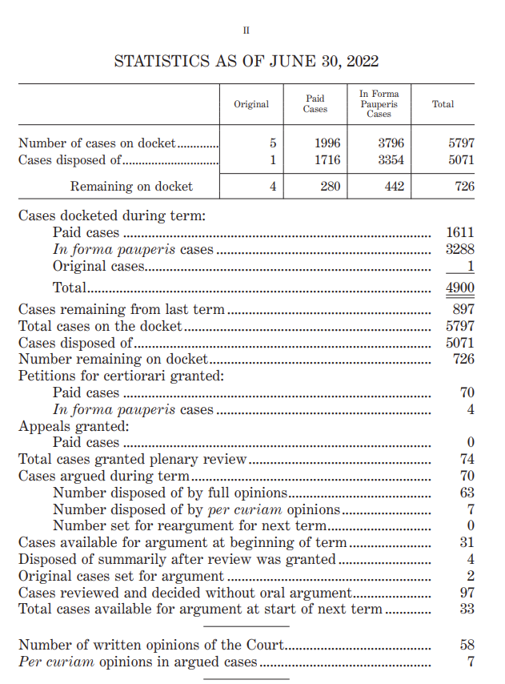
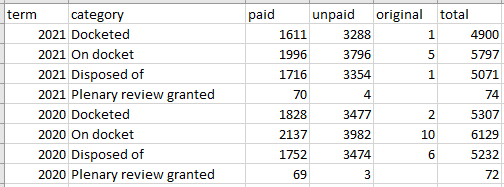
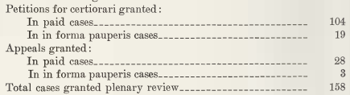

# SCOTUS Caseload Data

This repository contains data on the caseload of the Supreme Court of
the United States. That is, it records how many cases are filed at the
Court in every term, how many cases are on the Court’s docket in every
term, how many cases they dispose of, and how many cases are granted
plenary review. (In this context, “plenary review” contrasts with
various summary dispositions.)

## Where does the data come from?

These data were obtained from the [Journal of the Supreme Court of the
United States](https://www.supremecourt.gov/orders/journal.aspx), which
contains the official minutes of the Court. At the front of each term’s
Journal, summary statistics on (among other things) the Court’s caseload
are given; here’s an example from the Court’s most recent Journal:

<!-- -->

I compiled statistics from each term’s journal into a single CSV file.

## What’s in the dataset?

Currently statistics are available for the post-WWII Court (terms
1946–2021). For each term, I recorded information from the Journal about
how many cases were docketed (i.e. filed at the Supreme Court), how many
were on the Court’s docket (this includes the cases filed at the Court
in the present term, plus any cases leftover from the previous term(s)),
how many cases were “disposed of” (that is, the Court actually did
something with it and got it off their docket), and how many cases were
granted plenary review. The data look like this:

<!-- -->

So each row of the dataset tells you, for a particular term, how many
paid, unpaid, and original jurisdiction (and total) cases fall into a
particular category. More specifically, the variables recorded are

- `term`: This is an integer variable that records which “October Term”
  of the Court the data in the rest of the row correspond to. (The
  Supreme Court does not do business on or record statistics on standard
  calendar years that run from January to December; rather a term of the
  Court begins on the first Monday in October and runs until late June
  or early July, when the Court recesses until the next term begins.)
- `category`: This is a character variable that indicates what type of
  statistic is recorded in the `paid`, `unpaid`, `original`, and `total`
  variables. Possible values included
  - “Docketed”: This means how many cases were filed at the Supreme
    Court and put onto its docket.
  - “On docket”: This means how many cases were on the Court’s docket,
    whether they were filed in this term or leftover from a previous
    term.
  - “Disposed of”: This means how many cases the Court did something
    with and got off their docket. Most commonly this is done by
    declining to review a case. The Court also “disposes of” a case by
    issuing an opinion after full hearing, or by summary methods of
    disposition.
  - “Plenary review granted”: This means how many cases the Court agrees
    to give a full hearing.
- `paid`: This is an integer variable indicating how many *paid* appeals
  and petitions for writ of certiorari were recorded for the given
  term-category.
- `unpaid`: This is an integer variable indicating how many *in forma
  pauperis* appeals and petitions for writ of certiorari were recorded
  for the given term-category. That is, the Court allows indigent
  litigants to file cases for free. See Rule 39 of [the Rules of the
  Supreme Court of the United
  States](https://www.supremecourt.gov/ctrules/2019RulesoftheCourt.pdf)
  for details.
- `original`: This is an integer variable indicating how many *original
  jurisdiction* cases were recorded for the given term-category. That
  is, in some circumstances, litigants may file a lawsuit directly at
  the Supreme Court rather than filing in some other court first and
  ending up at the Supreme Court to appeal the ruling of that other
  court. See Rule 17 of [the Rules of the Supreme Court of the United
  States](https://www.supremecourt.gov/ctrules/2019RulesoftheCourt.pdf)
  for details.
- `total`: This is an integer variable indicating how many *total* cases
  were recorded for the given term-category. In general, this should be
  the sum of `paid`, `unpaid`, and `original` and is mostly provided for
  convenience purposes. However, under some circumstances there can be
  differences. For example, the 1980 Journal of the Supreme Court lists
  132 paid cases granted plenary review and 22 unpaid cases granted
  plenary review, but 158 total cases granted plenary review rather than
  154 (see image below). Total discrepancies are in the Journal are
  rare, and are usually obvious typos (such as a transposed digits). In
  the case of transposed digits or one-off errors to a digit, I correct
  the “obvious typos”. In all other cases, I record the total given by
  the Journal even if it disagrees with the sum of `paid`, `unpaid`, and
  `original`. (This only occurs 7 times in the data.)

Example of a total discrepancy in the 1980 Journal of the Supreme Court:

<!-- -->

## Notes
